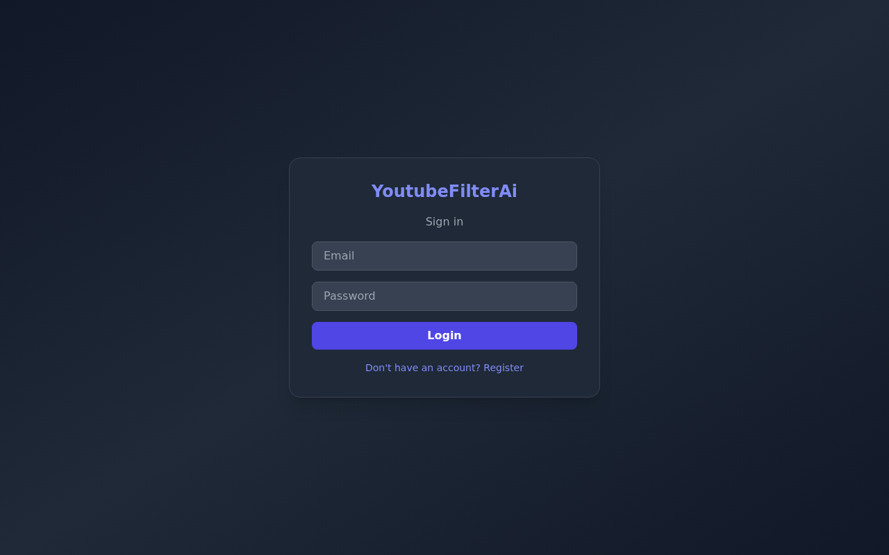
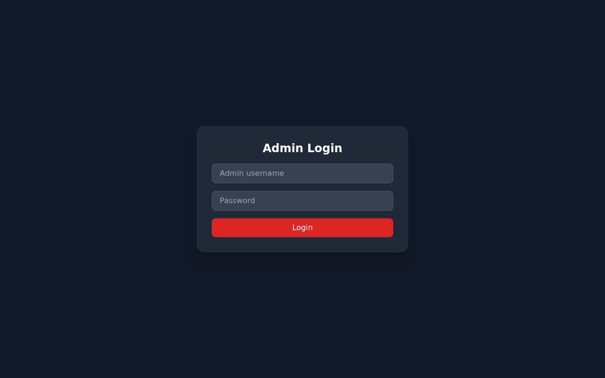
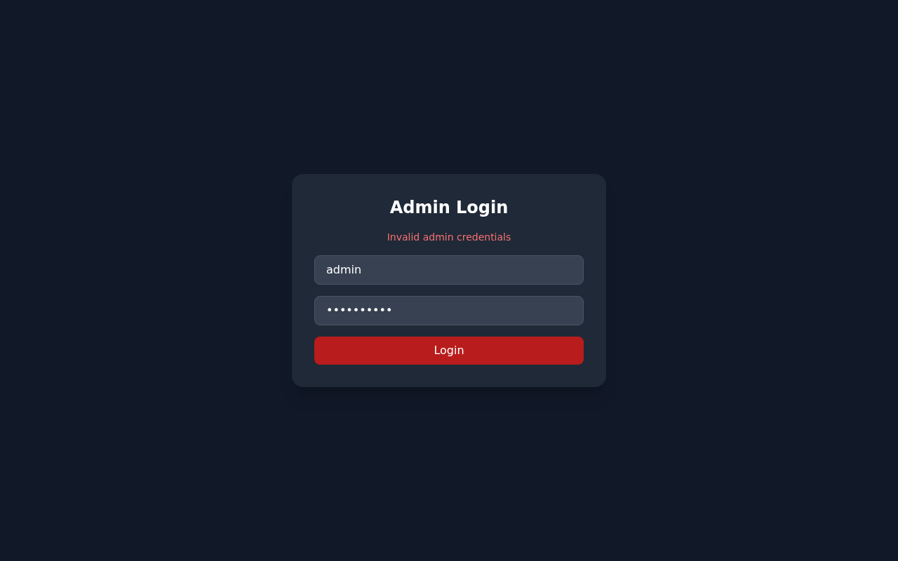
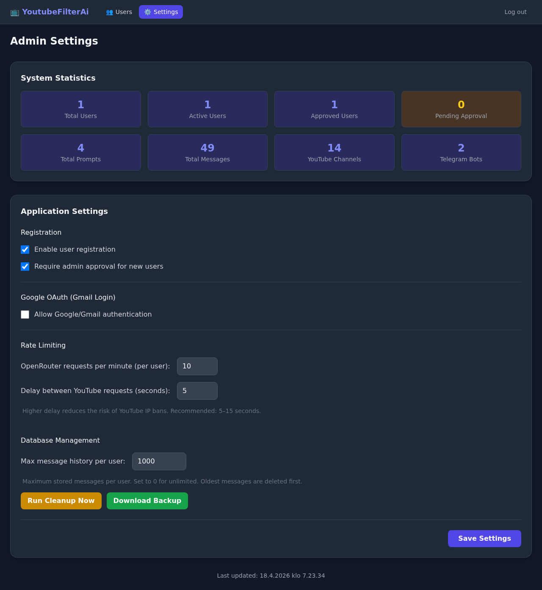
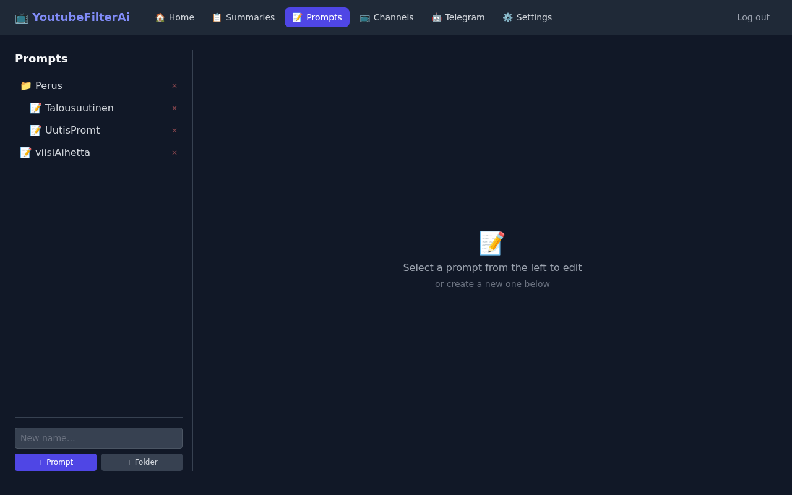
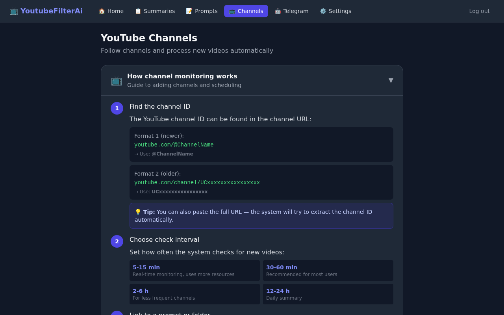
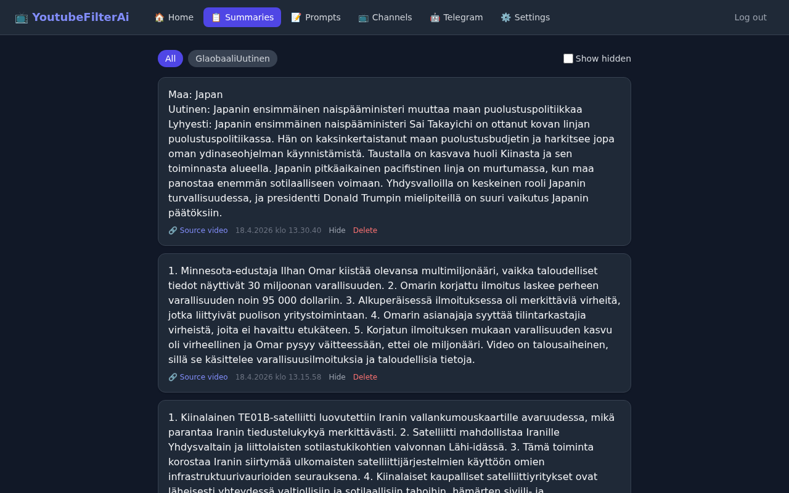
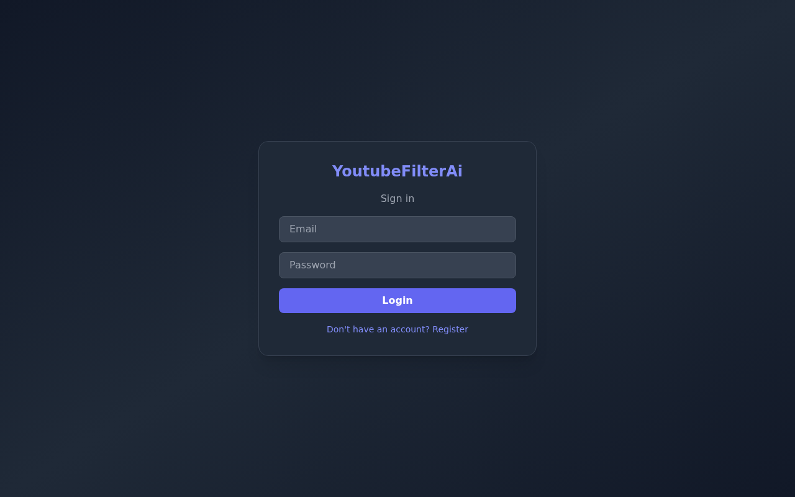

# 🎬 YoutubeFilterAi

> AI-powered YouTube transcript filter and summariser with Telegram bot integration, web views, and admin panel.

[](https://github.com/rafukei/YoutubeFilterAi/releases)
[](https://python.org)
[](https://react.dev)

---

## 📸 Screenshots

### Login & Registration
<p align="center">
  
</p>

### Admin Login
<p align="center">
  
</p>

### Admin — User Management
<p align="center">
  
</p>

### Admin — System Settings & Statistics
<p align="center">
  
</p>

### Dashboard
<p align="center">
  
</p>

### Prompt Editor (folder tree & AI model selection)
<p align="center">
  
</p>

### YouTube Channel Subscriptions
<p align="center">
  
</p>

### Summary / Web Views
<p align="center">
  
</p>

### User Settings & Data Export/Import
<p align="center">
  
</p>

### Telegram Bot Configuration
<p align="center">
  
</p>

---

## ✨ Features

- **🤖 AI Video Summarisation** — Paste a YouTube URL, choose a prompt, get an AI summary
- **📂 Prompt Templates** — Folder/tree structure, per-prompt AI model selection, fallback models
- **✏️ Inline Rename** — Double-click to rename prompts and folders
- **📺 Channel Monitoring** — Subscribe to YouTube channels with scheduled auto-checking
- **🧭 FIFO Scheduler Queue** — Oldest reserved channel is processed first (one reservation per channel)
- **⏱️ Transcript Cooldown & Telemetry** — Redis counters + cooldown windows to reduce repeated rate-limit failures
- **📨 Telegram Integration** — Auto-send summaries to your Telegram bots
- **🌐 Web Views** — Auto-created filtered views for categorised summaries
- **📥 Data Export/Import** — Download & restore your prompts and channel subscriptions
- **💾 Admin Backup** — Full database backup as JSON
- **🔒 Admin Panel** — User management, system settings, statistics dashboard
- **📊 Database Maintenance** — Configurable message history limit with cleanup
- **🔐 Auth** — JWT + bcrypt, optional Google OAuth, admin approval workflow
- **🛡️ GDPR** — Consent tracking, cascade delete removes all user data

---

## 🏗️ Architecture

```
┌─────────┐     ┌──────────────┐     ┌─────────────┐
│  NGINX  │────▶│  React SPA   │     │  PostgreSQL  │
│  :80    │     │  (Vite) :5173│     │    :5432     │
│         │────▶│              │     └──────▲───────┘
│         │     └──────────────┘            │
│         │────▶┌──────────────┐     ┌──────┴───────┐
│         │     │  FastAPI     │────▶│    Redis      │
│         │     │  :8000       │     │    :6379      │
│         │     └──────┬───────┘     └──────────────┘
└─────────┘            │
                       ├──▶ YouTube Transcript API
                       ├──▶ OpenRouter AI API
                       └──▶ Telegram Bot API
```

| Service    | Tech              | Purpose                              |
|------------|-------------------|--------------------------------------|
| `backend`  | Python / FastAPI  | REST API, auth, AI pipeline          |
| `frontend` | React / Vite / TS | User & admin interfaces              |
| `db`       | PostgreSQL 16     | Persistent storage (7 tables)        |
| `redis`    | Redis 7           | Rate limiting for OpenRouter calls   |
| `nginx`    | NGINX             | Reverse proxy                        |

---

## 🚀 Quick Start

```bash
# 1. Clone and configure
git clone https://github.com/rafukei/YoutubeFilterAi.git
cd YoutubeFilterAi
cp .env.example .env    # ← edit SECRET_KEY, ADMIN_PASSWORD

# 2. Start everything
docker compose up --build

# 3. Open browser
# User UI:  http://localhost
# Admin UI: http://localhost/admin/login
# API docs: http://localhost/api/docs
```

### 🍓 Raspberry Pi

Works on Pi 4/5 with 4GB+ RAM (64-bit OS required):

```bash
sudo apt install docker.io docker-compose-plugin
cp .env.example .env
docker compose up --build -d
```

---

## 🔑 Key Concepts

### Prompt Routing

Every prompt ends with a JSON routing block that tells the system where to send the AI result:

```json
{
  "message": "the final summary...",
  "telegram_bots": ["financial_news_bot"],
  "web_views": ["FinancialNews"],
  "visibility": true
}
```

- **`web_views`**: Auto-created as tabs on the Summary page
- **`telegram_bots`**: Sends the message to named Telegram bots
- **`visibility`**: Controls whether the message appears in web views

### Processing Pipeline

1. User submits YouTube URL + prompt
2. Backend fetches transcript via `youtube-transcript-api`
3. Transcript + prompt sent to OpenRouter AI (user's own API key)
4. AI response parsed for routing JSON
5. Web views auto-created if they don't exist
6. Message stored in DB, sent to specified Telegram bots
7. Source video URL always included for verification

### Rate Limiting

Free-tier OpenRouter: configurable via admin settings, tracked per-user in Redis.

YouTube transcript fetches also use Redis-based rolling counters and cooldown keys to avoid repeating known rate-limited requests.

---

## 🗄️ Database Schema

7 tables — see `backend/app/models.py`:

| Table | Purpose |
|-------|---------|
| `users` | Credentials, role, GDPR consent, OpenRouter token |
| `prompts` | Tree structure (folders via `parent_id`), AI model config |
| `youtube_channels` | Subscriptions with scheduling & auto-check |
| `telegram_bots` | Per-user bot tokens and chat IDs |
| `web_views` | Named summary pages (auto-created from routing) |
| `messages` | AI responses with source URLs and routing info |
| `app_settings` | Runtime admin config (singleton) |

---

## 🔧 Admin Panel

Access at `/admin/login` with credentials from `.env`.

| Feature | Description |
|---------|-------------|
| **User Management** | Create, approve, deactivate, delete users |
| **System Settings** | Toggle registration, OAuth, rate limits |
| **Message Limit** | Configurable max messages per user (cleanup oldest) |
| **Statistics** | Users, prompts, messages, channels, bots counts |
| **Database Backup** | Full JSON export of all tables |
| **Message Cleanup** | One-click enforcement of history limits |

---

## 📦 Data Export & Import

**Users** can export/import their data from Settings:

- **Export**: Downloads all prompts + channel subscriptions as JSON
- **Import**: Restores from a previous export (skips duplicates)

**Admins** can create full database backups (excludes passwords/tokens).

---

## 🧪 Tests

```bash
# Run all tests
cd backend && pytest tests/ -v

# Or in Docker
docker compose exec backend python -m pytest tests/ -v
```

| Test File | Coverage |
|-----------|----------|
| `test_auth.py` | JWT, password hashing |
| `test_auth_api.py` | Login, register, Google OAuth |
| `test_resources_api.py` | CRUD for prompts, channels, bots, views |
| `test_process_api.py` | Video processing pipeline |
| `test_admin_api.py` | Admin endpoints |
| `test_folder_prompts.py` | Folder/tree prompt structure |
| `test_maintenance.py` | Cleanup, export, import, backup |

---

## 🛡️ Security & GDPR

- JWT authentication (bcrypt password hashing)
- Admin credentials in `.env` only (not in database)
- Optional Google OAuth2
- GDPR consent timestamp on user model
- Cascade delete removes all user data
- No secrets in code — `.env` excluded from git
- HTTPS handled by external NGINX/load balancer

---

## 📁 Project Structure

```
├── backend/
│   ├── app/
│   │   ├── main.py                # FastAPI entrypoint + DB migrations
│   │   ├── config.py              # Settings from env vars
│   │   ├── database.py            # Async SQLAlchemy setup
│   │   ├── models.py              # ORM models (7 tables)
│   │   ├── schemas.py             # Pydantic request/response
│   │   ├── auth.py                # JWT, password hashing
│   │   ├── api/
│   │   │   ├── auth_routes.py     # Login, register, OAuth
│   │   │   ├── resource_routes.py # CRUD + export/import
│   │   │   ├── process_routes.py  # Video processing pipeline
│   │   │   └── admin_routes.py    # Admin, backup, cleanup
│   │   └── services/
│   │       ├── __init__.py        # YouTube transcript fetcher
│   │       ├── ai_service.py      # OpenRouter client + rate limiter
│   │       ├── scheduler.py       # Channel auto-check scheduler
│   │       └── telegram_service.py
│   └── tests/                     # 7 test files
├── frontend/
│   ├── src/
│   │   ├── App.tsx                # Router + auth state
│   │   ├── api.ts                 # Axios client with JWT
│   │   ├── components/Layout.tsx  # Nav bar
│   │   └── pages/                 # 10 page components
│   └── tests/                     # Playwright E2E tests
├── nginx/nginx.conf
├── docker-compose.yml
├── .env.example
└── docs/screenshots/              # UI screenshots
```

---

## 🔄 Changelog

### v1.3.0
- 🧭 Scheduler queue policy is now FIFO (oldest reservation first) with per-channel reservation deduplication
- ⏱️ Transcript rate-limit telemetry + cooldown windows added for auto-processing
- 🔁 Improved scheduler IP-block handling (faster cooldown trigger, safer reset semantics)
- 🛡️ Frontend crash hardening (global error boundary + safer API error rendering)
- 🔐 Documentation helper script no longer stores credentials in source (env vars only)

### v1.2.0
- 🐛 Web views auto-created from prompt routing (fix: messages were silently dropped)
- ✏️ Double-click to rename prompts/folders
- 🔧 Startup DB migration for schema upgrades

### v1.1.0
- 📊 Admin-configurable message history limit
- 📥 User data export/import (prompts + channels)
- 💾 Admin full database backup
- 🧹 Message cleanup endpoint
- 📁 Prompt folder/tree structure
- 🤖 AI model fallback support

### v1.0.0
- 🎉 Initial release
- YouTube transcript → AI → Telegram/Web pipeline
- JWT auth, admin panel, rate limiting

---

## 📄 License

MIT
